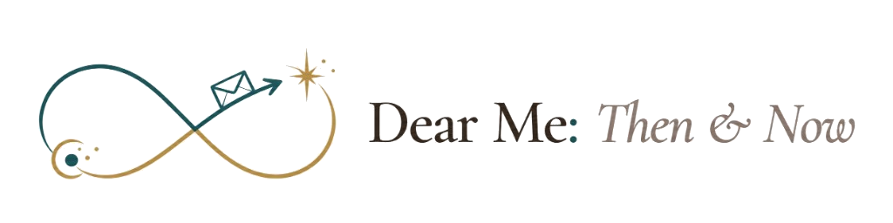
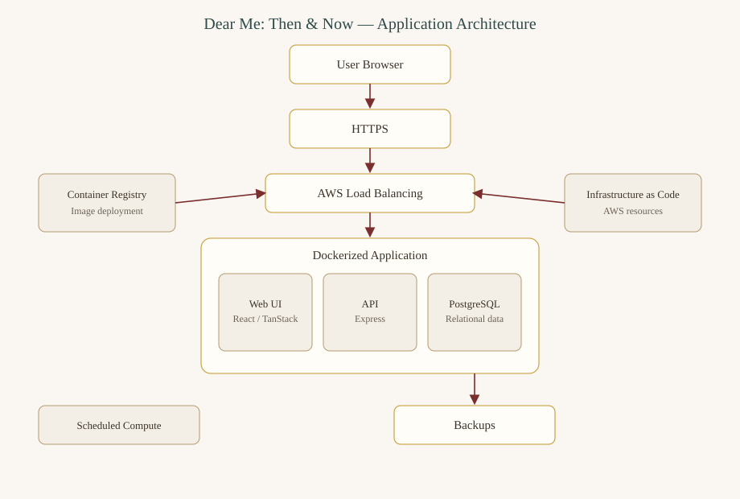
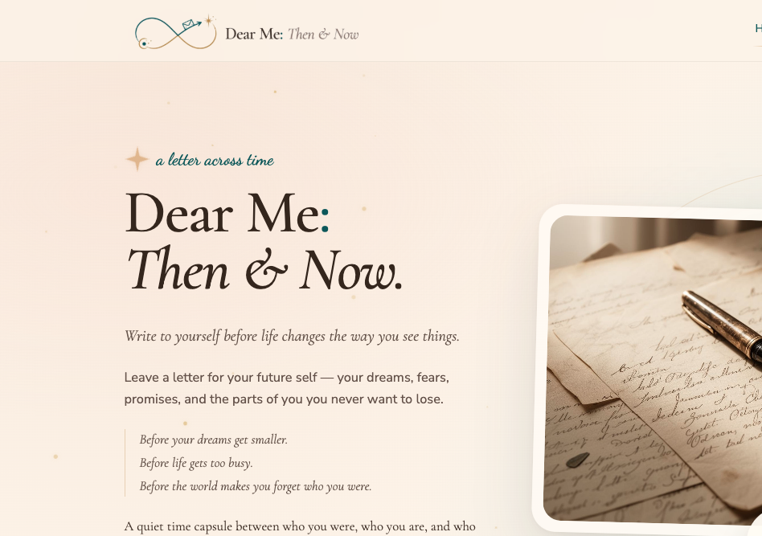
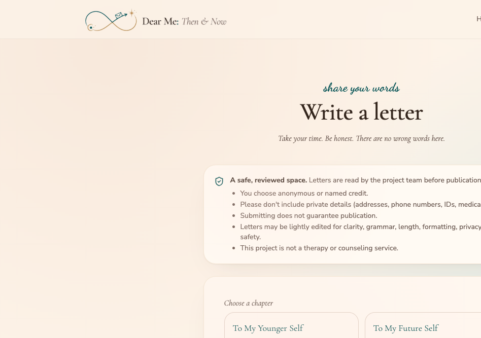
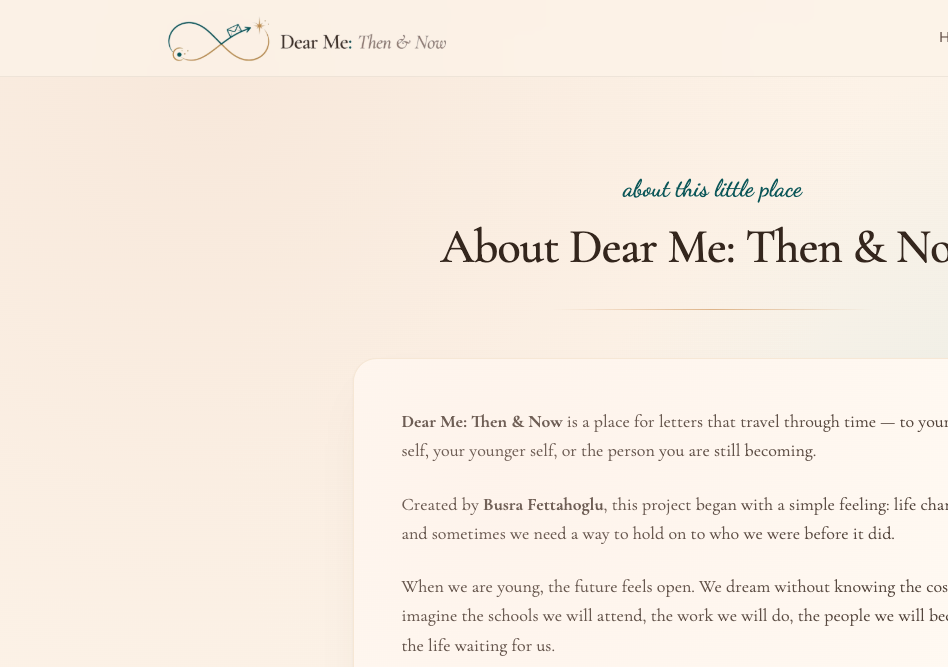

# Dear Me: Then & Now

A digital time capsule for letters to who we were, who we are, and who we are becoming.

<p align="center">
  
</p>

**Live Project:** https://dearmethenandnow.com/

This is a real deployed application, not merely a prototype.

## Overview

Dear Me: Then & Now is a digital time-capsule platform. People write letters to a younger self, a future self, or the person they are still becoming. The letters are meant to hold onto hopes, fears, promises, and the parts of a person that time can quietly change.

Submitted letters are reviewed before they appear in the public archive. The platform also supports selecting approved letters for a future book manuscript.

The project was created by **Busra Fettahoglu**.

## How It Works

```
Write a Letter
      ↓
Consent & Submission
      ↓
Review
      ↓
Approved Public Archive
      ↓
Book Selection
```

A visitor chooses a letter chapter, writes in their own words, and completes a consent workflow. The letter is held for review. Only approved letters are shown publicly. Selected letters can later be prepared as a manuscript.

## Features

- Guided letter-writing experience
- Four letter chapters: To My Younger Self, To My Future Self, What I Wish I Knew, and Becoming Me
- Public archive with search and chapter filters
- Consent workflow before submission
- Additional permission handling for minors
- Human review before publication
- Selected-letter workflow for book preparation
- PDF manuscript generation
- Responsive layout for desktop and mobile
- Reduced-motion support
- Live HTTPS deployment

## Architecture

The application is a full-stack web product deployed on AWS.

```
Browser
   ↓
HTTPS / Load Balancer
   ↓
AWS Compute
   ↓
Dockerized Web Application
   ├── React / TanStack frontend
   ├── Express API
   └── PostgreSQL
             ↓
       Backup Storage
```

Supporting infrastructure:

- Container registry for application images
- Infrastructure as Code for AWS resources
- Scheduled compute for resource management



### Technologies

**Frontend**
- React
- TanStack
- TypeScript
- Tailwind CSS

**Backend**
- Express
- PostgreSQL
- Docker

**Cloud**
- AWS
- CloudFormation
- EC2 / Auto Scaling
- Application Load Balancer
- ECR
- S3
- Systems Manager
- Route 53
- ACM / HTTPS

## Privacy & Consent

- Submitted letters are not automatically public.
- Submissions begin in a review state.
- Only approved letters appear in the public archive.
- The writing flow includes required consent acknowledgments.
- Additional permission handling exists for minors.
- Contact information is collected only when provided and is not displayed as part of public letters.

## Engineering

This project is more than a static website. It combines:

- a server-rendered, full-stack web application
- a REST API
- relational persistence
- a moderation workflow
- Docker-based deployment
- AWS infrastructure
- infrastructure as code
- a backup and restore strategy
- health checking
- scheduled compute

The result is a live application that accepts submissions, stores them, reviews them, and publishes only approved letters.

## Project Status

Dear Me: Then & Now is live and actively developed. The current platform supports letter submission, moderation, public browsing, and preparation of selected letters for a future book.

Live project: https://dearmethenandnow.com/

## Screenshots

### Homepage



### Write a Letter



### About



## Creator

**Busra Fettahoglu**  
High School Junior

Interests: Electrical & Computer Engineering, software systems, cloud engineering, human-centered technology, and accessible technology.

## License

This repository contains public documentation and portfolio materials only. See [LICENSE](LICENSE). Application source code and production configuration are not included.
